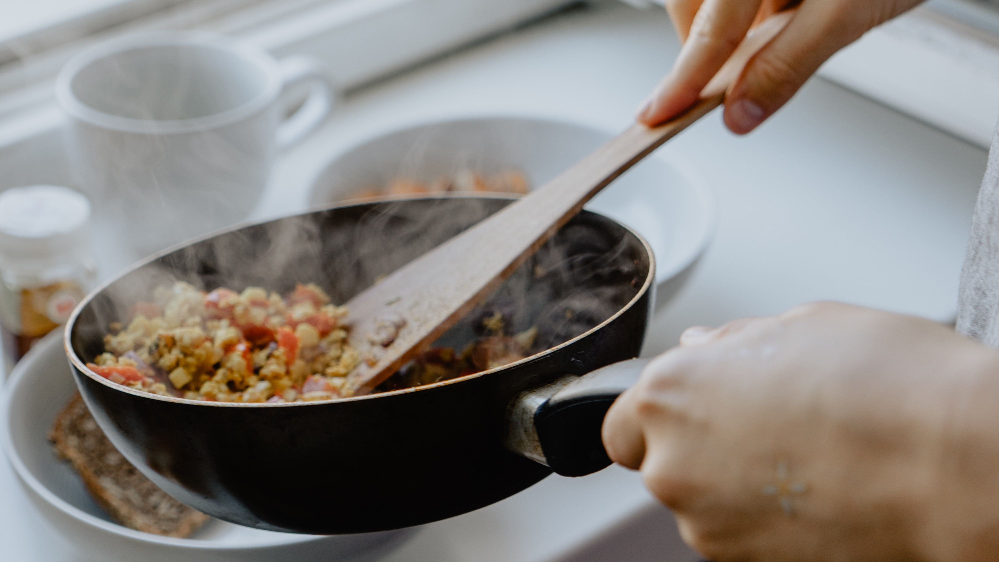

<a style="background-color:black;color:white;text-decoration:none;padding:4px 6px;font-family:-apple-system, BlinkMacSystemFont, &quot;San Francisco&quot;, &quot;Helvetica Neue&quot;, Helvetica, Ubuntu, Roboto, Noto, &quot;Segoe UI&quot;, Arial, sans-serif;font-size:12px;font-weight:bold;line-height:1.2;display:inline-block;border-radius:3px" href="https://unsplash.com/@kevinmccutcheon?utm_medium=referral&amp;utm_campaign=photographer-credit&amp;utm_content=creditBadge" target="_blank" rel="noopener noreferrer" title="Download free do whatever you want high-resolution photos from Kevin McCutcheon"><svg xmlns="http://www.w3.org/2000/svg" style="height:12px;width:auto;position:relative;vertical-align:middle;top:-2px;fill:white" viewBox="0 0 32 32"><title>unsplash-logo</title><path d="M10 9V0h12v9H10zm12 5h10v18H0V14h10v9h12v-9z"></path></svg>Kevin McCutcheon</a>

Today I read this article in [the Atlantic titled “The Why of Cooking”](https://www.theatlantic.com/entertainment/archive/2017/04/the-why-of-cooking-samin-nosrat/523923/?single_page=true). At start, this article made me question myself on what it means to be able to cook. But it didn’t end there, as I read on and thought more about this topic I found a hazy analogy in my mental model about cooking and programming. Well I won’t deny that it probably stems from the bias created because of my day-to-day exposure to computer related works. So, if You will, please continue and let yourself be mislead by my thought.

# What the article is really about

To be honest I don’t want to retell what the article is about since my interpretation and how I present it may make You lose interest in reading the whole article. But, for the sake of continuing my ramble please bear with it, and if you’re interested in learning to cook (in the context of really learning how to cook itself not only following certain recipe to produce a food) by all mean [the article](https://www.theatlantic.com/entertainment/archive/2017/04/the-why-of-cooking-samin-nosrat/523923/?single_page=true) a good read.
But for the TLDR version, in the article the author recounted his journey on finding a book, which he could read from the start to finish in order to learn how to cook. Not in a format where he could follow step by step and be able to present a meal. Nor an encyclopedia of references where he could learn part by part about certain element of cooking. But in the context of really understanding of why a cook need to do certain things or adding certain ingredients (thus the name of the article). This is what he calls _meta-cookbook_, or to quote the author himself “a book not about a certain cuisine or style of cooking, but about cooking itself”.

# What I keep thinking inside my head

Could programming in the future become like cooking now? Well that’s a really broad thoughts to be honest. When I tried to elaborate more on this thought to myself there’s one thing that was bugging me. Can it be, that somewhere in the future people think about programming in terms of how we see cooking today. These were the scenario that was playing out in my mind to compare the analogy of cooking today with future programming.

## What I Want to Cook

Maybe, just maybe, in the future we can craft our own program like how we follow a cooking’s recipe. For this part, especially if you are a critical thinker please reach out to me if you find this explanation quite cringey. Since, if I may justify myself, it is a hazy analogy with a not-so-thoughtful thought which I just need to let out. So, lets say You want to make an application which can track your spending by taking picture of your receipt and automatically use NLP to extract the type, value, and place where You spend it. Then remind You why You spend it by voice-recording the reason of spending.

## The Ingredients

To be able to achieve it You won’t need to know each of its’ _ingredients_ deeply. You only need to know the ingredient needed, i.e.: Taking picture, giving description, Extracting information from text, Recording our voice, and save all of it into records. Each ingredients’ level of abstraction may not be equal. Since if we may compare to cooking, it is possible to cook an instant noodle and serve it together with rice and omelet, chips and some salad. Well it may become a food nightmare but it’s possible and some people actually do that (well, not to that extend, maybe).

## The Recipe and Process

Then we need to _cook_ those ingredient together, some ingredient may need to be chopped before we process it, some may need to be precooked, or maybe one of the ingredient is actually an instant component which you only need to _pour_ in your stream of newest information. And to cook it together you need to have _utensils_ which can process the ingredients. Because you want to make something quite mainstream, you may want to look for its recipe first on your grandma’s recipe book, then follow the instructions there to _cook_ your application. While _cooking_ you may test the application, by taking a piece of your application and experiencing it, if you find it too _bland_ you can possibly add _seasonings_ into it (feedback into the “utensils”) so that its _taste_ will be well suited for You.

## The Serving

And after you are finished you may serve it to any possible _platform_. A plate, bowl, or a cup if you may. But remember some cooking may not be compatible with your platform (soup on a plate). And TA-DA~ your own application is served. You don’t really need to know what happened while you are boiling your ingredients, or how the taste will interact with each other when you add certain ingredients or spices. If you want to tweak it and dig deep into it, you can. But you need to learn the real cooking (or in this case the programming).

## The Satisfaction

Well... At last You’ve got to eat your own cooking and save some money. Even though it may not be so tasty and the serving may not be so pleasant it is still the fruit of your own work and labor so you can let yourself drown in the bliss.
