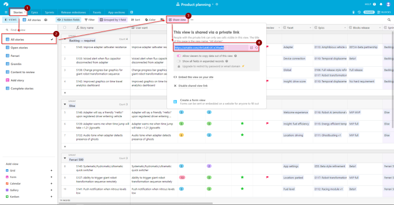
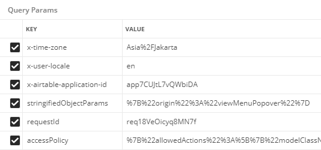
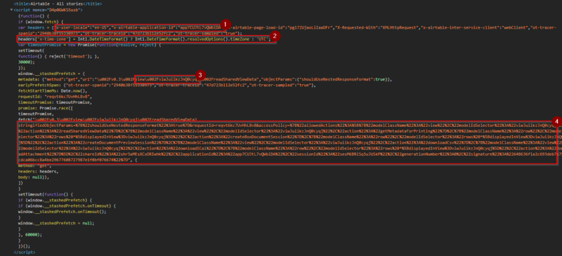

_Photo by jimmy teoh from Pexels_

Before we start, let's appreciate the fact that the [first part](https://medium.com/@adityarputra/scraping-the-surface-of-airtable-part-1-f79a6f9aca9b) is 2 yrs old!
Anyway, after 2 years of working on another things, I came back around to the same problem today. Still the same idea as part one, that is how can i connect multiple bases without the need of logging into airtable.
This part will be built on top of the first one, or to summarize: turns out I'm on the right track and requestId doesn't really matter too much, maybe I made mistake in copying it in the last post? Anyway in this post I will talk about several things:
- Why I choose not to use Airtable API?
- Why I decided to use native requests and didn't use headless browser
- My current solution using only requests and regex (its not pretty but it works :))
- Where can I go from here
If you want to follow along you can find the notebook and source code on my [github](https://github.com/banditelol/airscraper) or you can run it on [google colab](https://colab.research.google.com/github/banditelol/airscraper/blob/master/notebook/Airtable%20Scraping%20CSV.ipynb). If you just want to use the package, you could install it from [pip](https://badge.fury.io/py/airscraper). And use the code on your own risk, as this behavior is not guaranteed to be consistent over time (I don't know if airtable team decide to change it anytime soon). Okay, first let's address the elephant in the room.

## Why Not Airtable API
2 years ago when I was writing the first part, the API itself is still a work in progress by the airtable team, so basically I have no choice but to scrap my data. But today, after airtable has official API support, why do I decide not to use the API anyway? I have three main reasons:
- The API is rate limited to 5 requests per second as of today, and my current base has already multiple services hitting the API. So as to minimize the risk of hitting the rate limit and incur the 30 seconds penalty, I decided to not use the official API.
- I want to create the solution that could work just by using the table shared link. so that the accessible scope can be limited to only access certain part of the base (not the whole bases itself),
- And lastly, it seems fun doing this kind of thing sometimes :)

So, because of those three reasons I decided to create the solution which could work by only using the shared view link. But for any other purposes I really recommend using [their official API](airtable.com/api), as it's the way it's intended to be :D.

# Why not Headless Browser
Using headless browser I could simply head over to the link, and click on the "Download CSV" button and be done with it. And to be honest it seems to be a better option, but I want the solution to be as "light" as possible, and headless browser is not the smallest program out there. Thus I decided to work by onnly using the minimal amount of python packages. In this case, the solution practically only need [beautifulsoup4](https://www.crummy.com/software/BeautifulSoup/bs4/doc/F) to works.

# Current Solution
If you want to try this out without creating a new base, you could use my [experimentation base](https://airtable.com/invite/l?inviteId=invxuK3TxvlPPEAdP&inviteToken=f5a46b533c5f4f2d39af279f1c808ef0cf18ca728197657c8a9e5e26d6864c9a) to follow along.

## Create a Custom View and Create a Secret Link
I'm still using the same method as the first part, and the first thing i need to do is create the secret shared view link. To do so, just head over the table of interest, in this case we will use the Stories table, and All stories view. Then click on the Share view button and copy the generated grid view link. Oh, don't forget to keep the Allow viewers to copy data out of this view activated.



For the rest of this article we'll use the shared view link generated from that base: https://airtable.com/shr5aMEsXCxORIwhk

## Get the necessary Information From the Response
### What Necessary Info??
I'll explain a bit how I decided what is necessary information here. The first thing I did was to fire up the devtools and look at network tab, then click that "Download CSV" button. I found this to be the request fired by my browser to download the CSV.
```
https://airtable.com/v0.3/view/viwJuiikzJnQ0cyqj/downloadCsv?x-time-zone=Asia%2FJakarta&x-user-locale=en&x-airtable-application-id=app7CUJtL7vQWbiDA&stringifiedObjectParams=%7B%22origin%22%3A%22viewMenuPopover%22%7D&requestId=req18VeOicyq8MN7f&accessPolicy=%7B%22allowedActions%22%3A%5B%7B%22modelClassName%22%3A%22view%22%2C....
```
What does that even means? To find out, I head over to Postman and let it parse the parameter for me. The result, the request hits the endpoint of `https://airtable.com/v0.3/view/{viewId}/downloadCsv?{query_params}` with `viewId` as the id of our shared view, and the query params as shown below.



Okay, the next task that we need to do is finding out which parameter is necessary and how to generate them. I did it by eliminating one parameter at a time. After an hour of trial and error, I found out that practically no header need to be explicitly set. And for the request to succeed we need the following parameters:
- The `viewId` that is regenerated each time I load the page
- `AccessPolicy` that indicates what we are permitted to do in the shared 
- `AppId` I don't know what it indicates, but when I remove this parameter, the request always failed
- `Locale` that indicates our machine locale, I just use the default en value as I haven't bothered to find out other permitted value for this
- `Timezone` that is used to convert the time column in the view, according to user timezone.

With those in mind let's move on to retrieve those data from the shared view page.

### Retrieve those information
After trying another GET requests to the shared view url, and search for the parameters name, I found that the script tag right after the title tag contains all the necessary information that's needed.



After finding out where the wanted information are, we could Use some regex magic to extract those information (if you want to know how the regex works try regexr.com will help a lot in understanding what the patterns do).

<iframe
  src="https://carbon.now.sh/embed?bg=rgba(171%2C%20184%2C%20195%2C%201)&t=seti&wt=none&l=auto&ds=true&dsyoff=20px&dsblur=68px&wc=true&wa=true&pv=56px&ph=56px&ln=false&fl=1&fm=Hack&fs=14px&lh=133%25&si=false&es=2x&wm=false&code=view_id%2520%253D%2520re.search(r%2522(viw%255Ba-zA-Z0-9%255D%252B)%2522%252Cstr(script)).group(1)%250Aaccess_policy%2520%253D%2520re.search(r%2522accessPolicy%253D(%255Ba-zA-Z0-9%2525*%255D%252B)%2522%252Cstr(script)).group(1)%250Aapp_id%2520%253D%2520re.search(r%2522%255C%2522x-airtable-application-id%255C%2522%253A%255C%2522(app%255Ba-zA-Z0-9%255D%252B)%2522%252Cstr(script)).group(1)"
  style="width: 934px; height: 240px; border:0; transform: scale(1); overflow:hidden;"
  sandbox="allow-scripts allow-same-origin">
</iframe>

## Build URL to Download CSV and Fire!
With those parameters the last step is building the URL needed to download the CSV, and use it to send the GET requests.

<iframe
  src="https://carbon.now.sh/embed?bg=rgba(171%2C%20184%2C%20195%2C%201)&t=seti&wt=none&l=auto&ds=true&dsyoff=20px&dsblur=68px&wc=true&wa=true&pv=56px&ph=56px&ln=false&fl=1&fm=Hack&fs=14px&lh=133%25&si=false&es=2x&wm=false&code=self.csv_url%2520%253D%2520f%2522https%253A%252F%252Fairtable.com%252Fv0.3%252Fview%252F%257Bself.view_id%257D%252FdownloadCsv%253F%2522%250Afor%2520(k%252Cv)%2520in%2520self.params.items()%253A%250A%2509self.csv_url%2520%252B%253D%2520k%252B%2522%253D%2522%252Bv%252B%2522%2526%2522%250Aself.csv_url%2520%253D%2520self.csv_url%255B%253A-1%255D%250Ar%2520%253D%2520requests.get(self.csv_url)%250Ar.encoding%2520%253D%2520%2522utf-8%2522%250Ar.text"
  style="width: 791px; height: 312px; border:0; transform: scale(1); overflow:hidden;"
  sandbox="allow-scripts allow-same-origin">
</iframe>

It will return the CSV data that we want as a string. You could save it into file, or use StingIO to feed it into pandas, and so many more. By the way, I think airtable use UTF-8 to encode the CSV data, so make sure to change the response encoding after receiving the requests.

## Finished Script
Again, if you just want the finished product, You can clone the finished package from my github repository, or install it using pip and use it as a CLI.

<iframe
  src="https://carbon.now.sh/embed?bg=rgba(171%2C%20184%2C%20195%2C%201)&t=seti&wt=none&l=application%2Fx-sh&ds=true&dsyoff=20px&dsblur=68px&wc=true&wa=true&pv=56px&ph=56px&ln=false&fl=1&fm=Hack&fs=14px&lh=133%25&si=false&es=2x&wm=false&code=%2523%2520install%2520the%2520package%250Apip%2520install%2520airscraper%250A%250A%2523%2520pull%2520data%2520and%2520put%2520it%2520into%2520csv%250Aairscraper%2520%257Burl%257D%2520"
  style="width: 1024px; height: 473px; border:0; transform: scale(1); overflow:hidden;"
  sandbox="allow-scripts allow-same-origin">
</iframe>

# Where to go from Here?
Well, there are several things that we can expand upon this idea
- Create google function to serve as endpoint to backup airtable view
- Use it as part of ETL pipeline (like [airflow](airflow.apache.org), [singer](singer.io), etc.)
- Deploy a cron job calling this script to backup the data into your server

For the next part I think I'll go over how to use this as part of ETL pipeline in Google Cloud Platform using Functions and BigQuery, but seeing it took two whole years for me to continue the first one let's see how long it'll take me for the next part :) 
For now, thanks for reading and if you're interested in further discussion, feel free to hit me up in the comment or on my twitter [@BanditelolRP](twitter.com/BanditelolRP)
